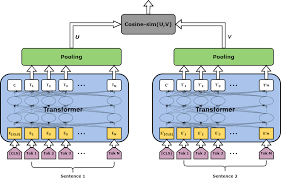

# Key-BERT

Welcome to the repository pertaining to my work on Keyword extraction from documents using semantic search , fuzzy logic and Sentence Transformers embedding models architecture using Key-BERT as the underlying architecture

This repo contains the code, dataset and the expected input output file
Since this was a done using a self trained model, the code is specific to the use case.Our use case is an unsupervised corpus independent keyphrase extraction.

 **Here's a little background on what Key-BERT is and how we made use of the Sentence Transformer Model**

 Key phrase extraction is a fundamental task in information management, which is often used as a preliminary step in various information retrieval and natural language processing tasks. Embedding models achieve higher F-scores than graph-based models in key phrase extraction for short documents compared to longer documents. Therefore, they are suitable for real-time semantic processing of short textual data. 
There are several proposed algorithms which successfully extract keywords from long sentence corpuses, however, their performance is comparatively unsatisfactory for short sentences. Key BERT is a minimal and easy-to-use. keyword extraction library that leverages embeddings from BERT-like models to extract key phrases from short sentences as well. Unlike other methods available for keyword generation like Rake and YAKE, KeyBERT uses BERT-embeddings and simple cosine similarity to find the sub-phrases in a document that are most like the document itself. KeyBERT supports many embedding models that can be used as an underlying architecture. Some of them are Sentence-Transformers, Flair, spaCy and Universal Sentence Encoder. All the above-mentioned models are pre-trained on more than 1 billion training pairs and are designed as general-purpose models

Heres a diagram to represent what Key-BERT does with short texts and how Sentence Transformers Embedding model uses it as an underlying architecture

 

And here's how sentence transformer extracts embeddings to obtain keyphrases

 

We obtained a 98% search accuracy on the model developed 

 

 

